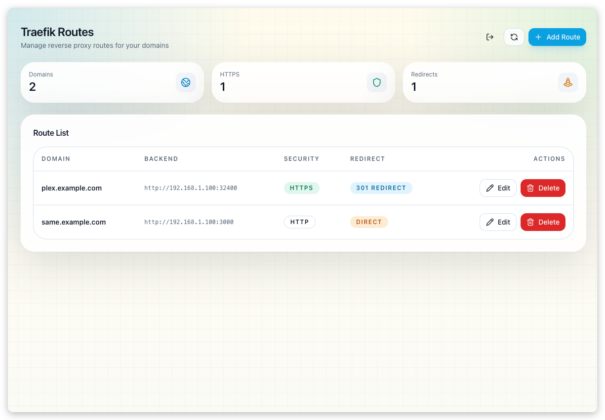
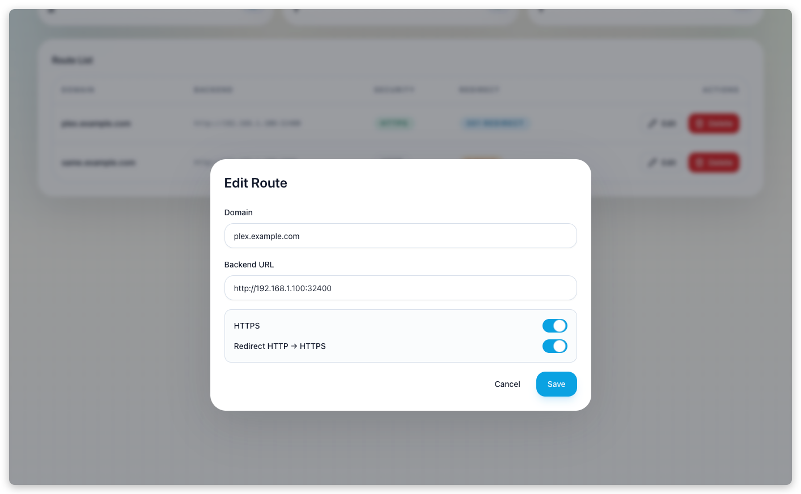

[中文](https://zdoc.app/zh/jae-jae/traefik-route-manager) | 
[Deutsch](https://zdoc.app/de/jae-jae/traefik-route-manager) | 
[English](https://zdoc.app/en/jae-jae/traefik-route-manager) | 
[Español](https://zdoc.app/es/jae-jae/traefik-route-manager) | 
[français](https://zdoc.app/fr/jae-jae/traefik-route-manager) | 
[日本語](https://zdoc.app/ja/jae-jae/traefik-route-manager) | 
[한국어](https://zdoc.app/ko/jae-jae/traefik-route-manager) | 
[Português](https://zdoc.app/pt/jae-jae/traefik-route-manager) | 
[Русский](https://zdoc.app/ru/jae-jae/traefik-route-manager)


# Traefik Route Manager

A lightweight, database-free web UI for managing Traefik file provider routes. Think of it as a minimal Nginx Proxy Manager for Traefik.

> 🌟 **Recommended**: [OllaMan](https://ollaman.com/) - Powerful Ollama AI Model Manager.




## Why This Exists

Traefik's file provider is powerful but editing YAML files manually is tedious. Existing solutions like Nginx Proxy Manager are great but require a database and are designed for Nginx.

**Traefik Route Manager** fills the gap:
- **Zero dependencies** - No database, no Redis, no external services
- **File-based** - Each route is a single YAML file, human-readable and version-controllable
- **Traefik native** - Outputs standard Traefik dynamic configuration

## Features

- 🗂️ **One domain, one file** - Routes stored as `trm-{domain}.yml` in your config directory
- 🔐 **HTTPS & redirects** - Toggle HTTPS and HTTP→HTTPS redirects per route
- 🤖 **AI Agent ready** - Built-in skill for AI assistants to manage routes via natural language
- 🪶 **Single binary** - Go backend + embedded React frontend, ~15MB image
- 🔑 **Token auth** - Simple shared-token authentication
- 📱 **Mobile-friendly** - Responsive UI works great on phones

## AI Agent Integration

Let AI assistants manage your routes with natural language commands like "Add a route for my Plex server".

```
Install this skill: https://raw.githubusercontent.com/jae-jae/traefik-route-manager/main/SKILL.md
```

See [SKILL.md](SKILL.md) for the full API documentation.

## Quick Start

### Docker

```bash
docker run -d \
  --name traefik-route-manager \
  -p 8892:8892 \
  -v /path/to/traefik/dynamic:/data \
  -e AUTH_TOKEN=your-secret-token \
  -e CONFIG_DIR=/data \
  ghcr.io/jae-jae/traefik-route-manager:main
```

### Docker Compose

```yaml
services:
  traefik-route-manager:
    image: ghcr.io/jae-jae/traefik-route-manager:main
    ports:
      - "8892:8892"
    volumes:
      - ./data:/data
    environment:
      - AUTH_TOKEN=your-secret-token
      - CONFIG_DIR=/data
```

### With Traefik

Configure Traefik to watch the same directory:

```yaml
# traefik.yml
providers:
  file:
    directory: /etc/traefik/dynamic
    watch: true
```

Mount the same volume in both containers:

```yaml
services:
  traefik:
    image: traefik
    volumes:
      - ./dynamic:/etc/traefik/dynamic

  traefik-route-manager:
    image: ghcr.io/jae-jae/traefik-route-manager:main
    volumes:
      - ./dynamic:/data
    environment:
      - AUTH_TOKEN=your-secret-token
      - CONFIG_DIR=/data
```

## Configuration

| Variable | Required | Default | Description |
|----------|----------|---------|-------------|
| `AUTH_TOKEN` | Yes | - | Token for login and API authentication |
| `CONFIG_DIR` | Yes | - | Directory to store route YAML files |
| `ADDR` | No | `:8892` | Server listen address |

## Generated YAML

Each route creates a file like `trm-plex.example.com.yml`:

```yaml
http:
  routers:
    plex-example-com:
      rule: "Host(`plex.example.com`)"
      service: plex-example-com-service
      entryPoints:
        - websecure
      tls: {}
    plex-example-com-redirect:  # If redirectHttps is enabled
      rule: "Host(`plex.example.com`)"
      service: plex-example-com-service
      entryPoints:
        - web
      middlewares:
        - plex-example-com-redirect-https
  services:
    plex-example-com-service:
      loadBalancer:
        servers:
          - url: http://192.168.1.100:32400
  middlewares:  # Only if redirectHttps is enabled
    plex-example-com-redirect-https:
      redirectScheme:
        scheme: https
        permanent: true
```

## Local Development

```bash
# Backend
export AUTH_TOKEN=dev-token
export CONFIG_DIR=$(pwd)/data
go run .

# Frontend (in another terminal)
cd web
bun install
bun run dev
```

## Tech Stack

- **Backend**: Go, Gin-compatible API
- **Frontend**: React 18, TypeScript, Vite, Tailwind CSS
- **Deployment**: Docker multi-stage build

## License

MIT
